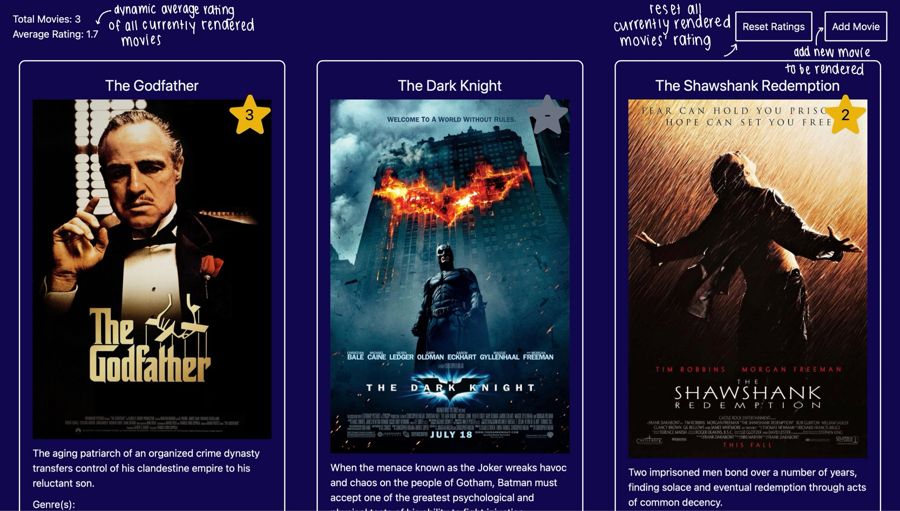

I completed this assignment as part of Chapter 1 of the Vue.js Essentials Training. The exact outline for the assignment can be found at the bottom of the page.

## How To Use
When first accessing site, you will be brought to this initial dashboard. The website will always populate with the following movies as they were defined in the .json file used to populate the site.

Each movie includes: title, image, description, genre, and rating

## Prerequisites
To start the applcation you must have npm installed. Then, simply run:
npm run dev

## Original Assignment 
---
difficulty: 1
chapter: "Chapter 1: Vue.js Essentials"
training: true
tags: vue
---

# Create a Movie Rating App

# Challenge Description
Your task is to create a Movie Rating App using Vue.js 3.
During this challenge, we’ll code out the following features:
- Rendering a list of movies.

## Requirements
- Define the movies as reactive data.
- Use the Vue.js template syntax to display the movie information.
- Render all the movies with a `v-for` loop.
- Display the name, description, genres, and image of each movie.
- Display the movie rating as stars, with a maximum of 5 stars

## Other Considerations

- If you see the `data-test` attribute anywhere in the boilerplate don't remove it.
- TailwindCSS is preinstalled with the default 